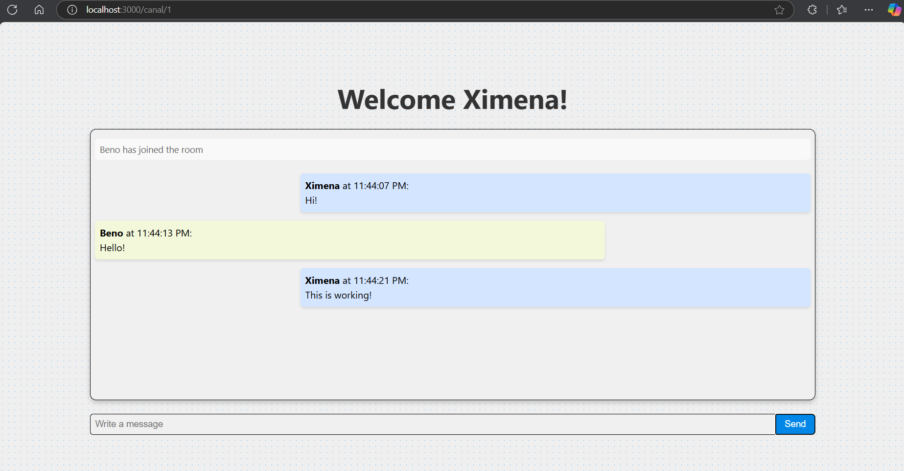

<!-- ABOUT THE PROJECT -->
## About The Project
This practice involves the development of an online chat that allows the sending of messages in real time through the implementation of Socket.io.

#### Click here to visualize -> [Try Live Chat](https://livechat-d5dz.onrender.com) !!




### Built With

* Express
* Socket.io
* TypeScript
* Nodemon
* Dotenv


## Getting Started


### Prerequisites

This is an example of how to list things you need to use the software and how to install them.
* Node.js
  ```sh
  node -v
  ```


### Installation

_Below you will find the installation instructions._


1. Clone the repo
   ```sh
   git clone https://github.com/github_username/repo_name.git
   ```
2. Install NPM packages
   ```sh
   npm install
   ```


<!-- USAGE EXAMPLES -->
## Usage

To use this project you will need to do the following.

1. Run the following command
   ```sh
   npm run dev
   ```
2. Go to a web browser
   ```sh
   localhost:3000
   ```
3. Insert your username
4. Select a chat-room
5. Start chatting!


